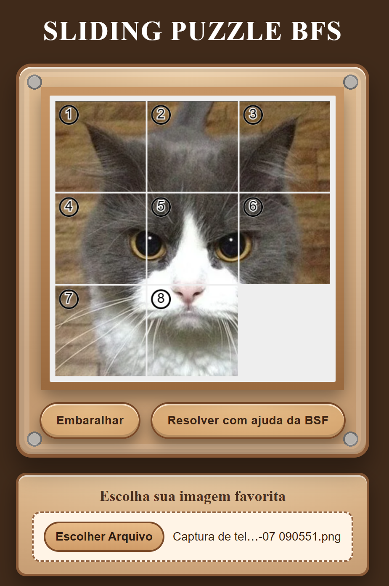
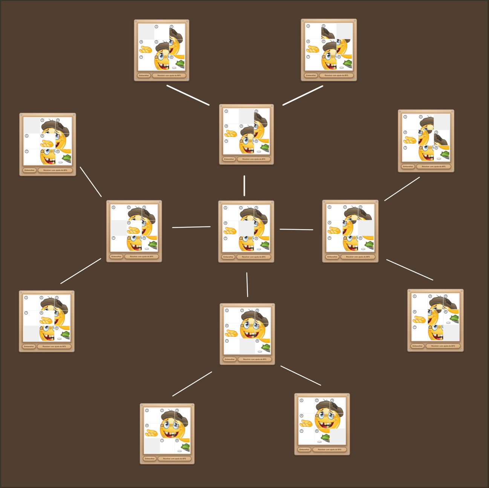

# Sliding Puzzle - GRAFOS 1 (Projeto)

**Conteúdo da Disciplina**: Grafos 1 

## Alunos

|Matrícula | Aluno |
| -- | -- |
| 21/1031673  | Cauã Matheus |
| 21/1030756  | Gabriela Silva Alves |

## Sobre

# Sobre

Este projeto implementa e explora algoritmos de grafos por meio do clássico **quebra-cabeça deslizante 3×3 (8-puzzle)**. A aplicação permite **embaralhar** o tabuleiro (a partir de movimentos válidos do espaço vazio), **interagir com as peças no canvas** e **resolver automaticamente** o estado atual usando **Busca em Largura (BFS)** para encontrar o **menor número de movimentos** até a configuração objetivo. Além disso, o jogo suporta o uso de **imagens personalizadas**.

**Principais funcionalidades:**

* **Embaralhamento:** gera estados alcançáveis aplicando movimentos válidos do vazio.
* **Interação no canvas:** arraste peças adjacentes ao espaço vazio.
* **Resolução automática com BFS:** construção do melhor caminho (menor quantidade de passos) por meio de fila, conjunto de visitados e mapa de predecessores.
* **Visual com imagem personalizada:** fatiamento proporcional da imagem (3×3), com compensação de proporção (offset/scale) e rótulos sobre cada peça.

## Screenshots

### Visualização 

### Representação em Grafo

---

## Instalação

**Linguagem**: Javascript 
**Framework**: Não utilizado 

Pré-requisitos:
- Navegador Web

## Uso

1. Link disponível no pages

## Apresentação

Vídeo disponível em: [Projeto De Algoritmos - Dupla 16 - Grafos 01 - Sliding Puzzle](https://youtu.be/NVsOllzd4Oc)

## Outros

Para dúvidas, sugestões ou melhorias, entre em contato com os autores.